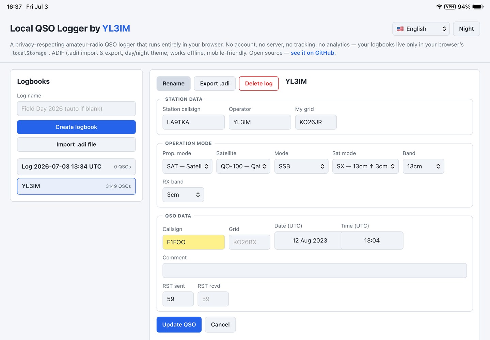
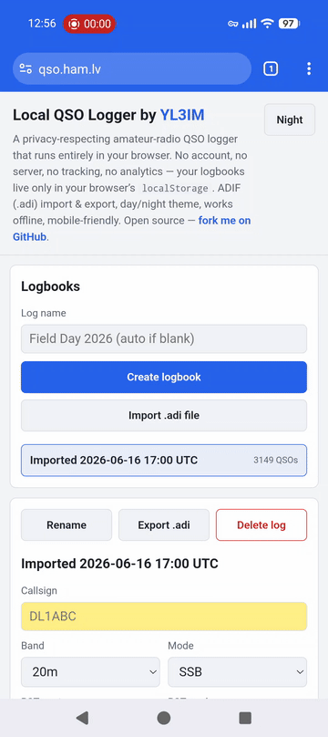

# Local QSO Logger

## Čitaj na svom jeziku

🇺🇸 [English](README.md) · 🇨🇿 [Čeština](README.cs.md) · 🇩🇰 [Dansk](README.da.md) · 🇩🇪 [Deutsch](README.de.md) · 🇪🇪 [Eesti](README.et.md) · 🇪🇸 [Español](README.es.md) · 🇫🇷 [Français](README.fr.md) · 🇮🇪 [Gaeilge](README.ga.md) · 🇭🇷 Hrvatski · 🇮🇹 [Italiano](README.it.md) · 🇱🇻 [Latviešu](README.lv.md) · 🇱🇹 [Lietuvių](README.lt.md) · 🇭🇺 [Magyar](README.hu.md) · 🇳🇱 [Nederlands](README.nl.md) · 🇳🇴 [Norsk](README.no.md) · 🇵🇱 [Polski](README.pl.md) · 🇵🇹 [Português](README.pt.md) · 🇷🇴 [Română](README.ro.md) · 🇸🇰 [Slovenčina](README.sk.md) · 🇸🇮 [Slovenščina](README.sl.md) · 🇫🇮 [Suomi](README.fi.md) · 🇸🇪 [Svenska](README.sv.md) · 🇧🇾 [Беларуская](README.be.md) · 🇧🇬 [Български](README.bg.md) · 🇷🇺 [Русский](README.ru.md) · 🇷🇸 [Српски](README.sr.md) · 🇺🇦 [Українська](README.uk.md) · 🇬🇷 [Ελληνικά](README.el.md)

Logger QSO za radioamatere koji poštuje privatnost i radi potpuno u vašem pregledniku. Bez računa, bez poslužitelja, bez praćenja, bez analitike — vaši dnevnici žive samo u `localStorage` vašeg preglednika i nikad ne napuštaju vaš uređaj.

Od [YL3IM](https://www.qrz.com/db/YL3IM). Web stranica projekta: [qso.ham.lv](https://qso.ham.lv).

## Sadržaj

- [Čitaj na svom jeziku](#čitaj-na-svom-jeziku)
- [Funkcije](#funkcije)
- [Početak](#početak)
- [Instalacija kao PWA na mobilnom](#instalacija-kao-pwa-na-mobilnom)
  - [iOS (samo Safari)](#ios-samo-safari)
  - [Android (Chrome / Edge / Firefox)](#android-chrome--edge--firefox)
- [Dnevnici](#dnevnici)
- [QSO-ovi](#qso-ovi)
- [Uvoz i izvoz ADIF](#uvoz-i-izvoz-adif)
- [Privatnost i podaci](#privatnost-i-podaci)
- [Jezik sučelja](#jezik-sučelja)
- [Teme](#teme)
- [Tehničke napomene](#tehničke-napomene)
- [Zahvale](#zahvale)

## Funkcije

- Više dnevnika; svaki s vlastitim popisom QSO-ova.
- Radnje dnevnika: stvaranje, preimenovanje, brisanje, uvoz iz ADIF, izvoz u ADIF (`.adi`).
- Obrazac QSO podijeljen u tri bloka: **Podaci postaje** (pozivni znak postaje, pozivni znak operatora, vlastita mreža) koji ostaju prilijepljeni između QSO-ova; **Način rada** (način širenja, satelit, način rada, satelitski način rada, pojas, RX pojas) sa satelitskim poljima koja se prikazuju samo kad je način širenja *Satelit*; i **Podaci QSO** (kontaktirani pozivni znak, kontaktirana mreža, UTC datum/vrijeme pri uređivanju, komentar, RST poslan, RST primljen).
- Potpuna ADIF `MODE` → `SUBMODE` taksonomija u padajućem izborniku načina rada — odaberi nadređeni način rada (`SSB`, `MFSK`, …) ili idi izravno na specifičan podnačin rada (`USB`, `FT4`, …); aplikacija pohranjuje oba polja prema ADIF-u, a tablica prikazuje specifičan podnačin kad postoji.
- Potpuni popis načina širenja ADIF (SAT, RPT, EME, ES, MS, Aurora itd.) kao padajući izbornik.
- Potpuni katalog satelita AMSAT (~110 satelita) i dvostupanjski padajući izbornik **Satelitski način rada**: preferirani dvoslovni kodovi uplink/downlink na vrhu (LU, LV, SX, UU, UV, VA, VU, VV) i starija jednoslovna označavanja (A/B/J/K/L/R/S/T/U/V/W/X) grupirana kao *zastarjela* ispod. Odabir satelitskog načina rada automatski prilagođava `BAND` (uplink) i `RX band` (downlink).
- Uređivanje i brisanje bilo kojeg QSO-a (s potvrdom pri brisanju).
- Razumne zadane vrijednosti: UTC datum/vrijeme predispunjeno na *sada*, zadani RST prema načinu rada (59 za glasovne načine rada, 599 za CW/digitalne), prilijepljeni podaci postaje + pojas + način rada + način širenja kroz uzastopne QSO-ove (samo polja po kontaktu — pozivni znak, njihova mreža, komentar, RST — brišu se nakon svakog *Upiši QSO*).
- Indikator dupliciranog pozivnog znaka u stvarnom vremenu (informativan — duplikati su dopušteni).
- Stupac zastave države izveden iz prefiksa pozivnog znaka (pokriva ≥99 % uobičajenih radioamaterskih prefiksa, uključujući prijenosne pozive kao `9A/M0NCG`).
- Prikaz datuma prilagođen lokalizaciji u tablici QSO-ova; ISO pohrana i ADIF izlaz ostaju nepromijenjeni.
- Sučelje dostupno na **28 jezika** (engleski plus 22 latinična, 5 ćiriličnih i grčki); birač s emoji zastavicama u zaglavlju.
- Teme dana / noći (dan je zadana; prekidač je u zaglavlju).
- Responzivni raspored prilagođen za mobitele s gumbima veličine dodira.
- Radi potpuno izvan mreže — bez mrežnih zahtjeva u bilo kojem trenutku.
- Može se instalirati kao PWA (Dodaj na početni zaslon / Instaliraj aplikaciju) pri hostingu preko HTTPS-a.

## Početak

Samo otvori `index.html` u modernom pregledniku. Bez koraka izgradnje, bez instalacije, bez poslužitelja.

Ako ga želiš hostati, postavi statičke datoteke (`index.html`, `style.css`, `app.js`, `favicon.svg`, `manifest.webmanifest`, `service-worker.js` i direktorij `i18n/` s 28 datoteka prijevoda) na bilo koji statički host (GitHub Pages, Netlify, vlastiti web poslužitelj). Radi i preko `file://` — registracija servisnog radnika automatski se preskače na protokolu `file:`, tako da otvaranje `index.html` izravno s diska funkcionira čisto.

Pri hostingu preko HTTPS-a, aplikacija postaje instalabilna kao PWA (izbornik preglednika *Instaliraj aplikaciju* / *Dodaj na početni zaslon*) i radi izvan mreže nakon prvog posjeta zahvaljujući servisnom radniku koji prioritizira predmemoriju i unaprijed predmemorira sve statičke datoteke (UI + svi prijevodi).

Zadani dnevnik automatski se stvara pri prvom posjetu, tako da možeš odmah početi bilježiti QSO-ove.

## Instalacija kao PWA na mobilnom

Kad je aplikacija hostana preko HTTPS-a (npr. GitHub Pages), možeš je instalirati na početni zaslon svog telefona tako da radi na cijelom zaslonu bez korisničkog sučelja preglednika. Nakon prvog pokretanja, servisni radnik predmemorira sve, tako da sljedeća pokretanja funkcioniraju potpuno izvan mreže.

### iOS (samo Safari)

Na iOS-u samo Safari može instalirati PWA-ove — preglednici trećih strana ne mogu.

1. Otvori stranicu u **Safariju**.
2. Tapkaj gumb **Dijeli**.
3. Odaberi **Dodaj na početni zaslon**, zatim **Dodaj**.

Vodič:

Izvor više kvalitete: [media/iOS_add_to_home_screen.mp4](media/iOS_add_to_home_screen.mp4).

### Android (Chrome / Edge / Firefox)

1. Otvori stranicu u pregledniku. Upit za *Instaliranje aplikacije* može se pojaviti automatski.
2. U protivnom, otvori **izbornik ⋮** → **Instaliraj aplikaciju** (ili **Dodaj na početni zaslon** na starijim verzijama).

Vodič:

Izvor više kvalitete: [media/Android_add_to_home_screen.mp4](media/Android_add_to_home_screen.mp4).

## Dnevnici

- **Stvori:** upiši naziv u *Naziv dnevnika* i pošalji. Ako ostaviš naziv praznim, koristi se `Log YYYY-MM-DD HH:MM UTC`.
- **Promijeni:** klikni na bilo koji dnevnik u bočnoj traci.
- **Preimenuj:** klikni na *Preimenuj* u zaglavlju dnevnika. Pritisni Enter za spremanje, Escape za odustajanje.
- **Briši:** klikni na *Obriši dnevnik*. Zatražit će se potvrda. Ako obrišeš posljednji dnevnik, automatski se stvara novi.

## QSO-ovi

- Ispuni obrazac i pritisni **Upiši QSO**.
- Obrazac je organiziran u tri bloka:
  - **Podaci postaje** — *Pozivni znak postaje* (tvoj odašiljački pozivni znak, ADIF `STATION_CALLSIGN`), *Operator* (pozivni znak pojedinog operatora — razlikuje se od *pozivnog znaka postaje* kad gostujući operator sjedi za mikrofonom klupske postaje; ADIF `OPERATOR`) i *Moja mreža* (ADIF `MY_GRIDSQUARE`). Ovi ostaju prilijepljeni između QSO-ova iste sesije — postavi ih jednom i prenose se.
  - **Način rada** — *Način širenja*, *Način rada*, *Pojas*, plus satelitska polja *Satelit* / *Satelitski način rada* / *RX pojas* kad je način širenja *Satelit*. Pojas, način rada i način širenja su prilijepljeni kao podaci postaje.
  - **Podaci QSO** — polja po kontaktu: *Pozivni znak*, *Mreža* (Maidenheadova mreža druge postaje), *Komentar* (ADIF `COMMENT`), *RST poslan*, *RST primljen*. Pri uređivanju postojećeg QSO-a, *Datum (UTC)* i *Vrijeme (UTC)* također se pojavljuju u ovom bloku. Ova polja se brišu nakon svakog *Upiši QSO*.
- Svi pozivni znakovi (kontaktirani, postaje, operatora) automatski se pišu velikim slovima dok tipkaš; oba polja mreže rade isto.
- Datum i vrijeme predispunjavaju se na *sada* u UTC-u pri slanju; pri uređivanju možeš upisati bilo koju vrijednost.
- RST poslan / RST primljen, ako se ostave prazni, zadano su **59** za glasovne načine rada (SSB/FM/DIGITALVOICE) i **599** za CW i digitalne načine rada (CW/FT8/FT4/RTTY/PSK31/JT65). Zadana vrijednost prati nadređeni MODE, pa odabir specifičnog podnačina kao *USB* ili *FT4* i dalje daje ispravnu zadanu vrijednost.
- Čip *Duplikat u ovom dnevniku* pojavljuje se ispod polja pozivnog znaka ako pozivni znak već postoji u trenutnom dnevniku. Duplikati *nisu* blokirani.
- **Način širenja** — opcijski padajući izbornik načina širenja ADIF (SAT, RPT, EME, F2, Es, MS, LOS itd.). Ostavi prazno za normalne zemaljske HF QSO-ove.
- **Satelitski QSO-ovi** — odabir načina širenja *Satelit* otkriva tri satelitska polja: **Satelit** (padajući izbornik od ~110 satelita registriranih u AMSAT-u), **Satelitski način rada** (AMSAT slovne oznake, grupirane kao *moderne* dvoslovne uplink/downlink šifre gore i *zastarjele* jednoslovne šifre ispod) i **RX pojas** (downlink pojas). Satelit, satelitski način rada i RX pojas su obavezni — preglednik će odbiti slanje bez njih. Odabirom **Satelitskog načina rada** automatski se ispunjava glavni **Pojas** uplink pojasom i **RX pojas** downlink pojasom (npr. način rada J → uplink 2m, downlink 70cm). Povratak na *satelit* iz drugog načina širenja resetira satelitski način rada da se odabere novi. Nesatelitski QSO-ovi nikad ne nose satelitska polja; prebacivanje postojećeg QSO-a sa satelita na drugi način širenja ih čisto uklanja. **Mreža** i **Moja mreža** su opća polja (korisna i za VHF/UHF natjecanja mreže) i ostaju vidljiva za sve QSO-ove.
- **Uredi QSO** gumbom *Uredi* u redu. Obrazac prelazi u način *Ažuriraj QSO*, red se ističe, a pojavljuje se gumb *Odustani*. Promjena dnevnika ili brisanje dnevnika automatski otkazuje uređivanje.
- **Obriši QSO** gumbom *Obriši* u redu (traži potvrdu).

## Uvoz i izvoz ADIF

- **Izvoz**: klikni na *Izvezi .adi* u zaglavlju dnevnika. Preuzima se datoteka u skladu s **ADIF 3.1.7**. Zaglavlje deklarira `ADIF_VER 3.1.7`, `PROGRAMID local-qso`, `PROGRAMVERSION` i `CREATED_TIMESTAMP` (UTC). Polja po QSO-u koja se emitiraju (kad nisu prazna): `CALL`, `QSO_DATE`, `TIME_ON`, `BAND`, `MODE`, `SUBMODE`, `PROP_MODE`, `GRIDSQUARE`, `BAND_RX`, `SAT_MODE`, `SAT_NAME`, `RST_SENT`, `RST_RCVD`, `COMMENT`, `STATION_CALLSIGN`, `OPERATOR`, `MY_GRIDSQUARE` — praćena svakim dodatnim ADIF poljem sačuvanim pri uvozu (vidi dolje).
- **Uvoz**: klikni na *Uvezi .adi datoteku* ispod obrasca za stvaranje dnevnika i odaberi `.adi` / `.adif` datoteku. Iz nje se stvara novi dnevnik, nazvan `Imported YYYY-MM-DD HH:MM UTC`. Uvoz se nikad ne spaja s postojećim dnevnikom.
- **Kružni tok bez gubitaka**: pri uvozu, svako ADIF polje koje aplikacija ne modelira u svom sučelju (npr. `NAME`, `FREQ`, `TX_PWR`, `DXCC`, `QSL_SENT`/`QSL_RCVD`, `POTA_REF`, `APP_*` polja) čuva se na QSO-u i doslovno se ponovo emitira pri sljedećem izvozu. Dakle izvoz datoteke koja je sama uvezena čuva sve.
- Duljina polja tretira se kao broj UTF-8 bajtova kako zahtijeva specifikacija, tako da se višebajtni tekst (npr. naglašeni znakovi u `COMMENT`) ispravno rastavlja.

## Privatnost i podaci

- Svi podaci pohranjuju se u `localStorage` tvog preglednika pod ključem `local-qso:v1`.
- Ništa se ne prenosi nigdje. Nema pozadinskog sustava, API poziva, telemetrije ni analitike.
- Brisanje podataka stranice preglednika, korištenje privatnog/inkognito načina ili drugog preglednika/uređaja znači novi prazan dnevnik — koristi *Izvezi .adi* za sigurnosno kopiranje.

## Jezik sučelja

Birač jezika u zaglavlju pokriva **28 jezika**. Odaberi jedan i ostatak sučelja odmah se ponovo prikazuje; tvoj odabir sprema se uz tvoje dnevnike i poštuje se pri sljedećem posjetu. Engleski je zadani.

Dostupni jezici (emoji zastavica + izvorni naziv; abecedno unutar svakog pisma):

🇺🇸 English · 🇨🇿 Čeština · 🇩🇰 Dansk · 🇩🇪 Deutsch · 🇪🇪 Eesti · 🇪🇸 Español · 🇫🇷 Français · 🇮🇪 Gaeilge · 🇭🇷 Hrvatski · 🇮🇹 Italiano · 🇱🇻 Latviešu · 🇱🇹 Lietuvių · 🇭🇺 Magyar · 🇳🇱 Nederlands · 🇳🇴 Norsk · 🇵🇱 Polski · 🇵🇹 Português · 🇷🇴 Română · 🇸🇰 Slovenčina · 🇸🇮 Slovenščina · 🇫🇮 Suomi · 🇸🇪 Svenska · 🇧🇾 Беларуская · 🇧🇬 Български · 🇷🇺 Русский · 🇷🇸 Српски · 🇺🇦 Українська · 🇬🇷 Ελληνικά

Univerzalne tehničke oznake ostaju u svom kanoničnom obliku u svim jezicima: nazivi pojaseva (`20m`, `70cm`, …), ADIF kodovi načina rada (`SSB`, `FT8`, `CW`, …), `QSO`, `RST`, `UTC` i ISO kodovi zemalja.

Nedostaje li niz u tvom jeziku? Svaki jezik je jedna mala datoteka pod [`i18n/`](i18n/) — kopiraj `i18n/en.js`, prevedi vrijednosti, spremi kao `i18n/<code>.js`, zatim dodaj `<script>` oznaku plus `<select>` opciju u `index.html` i kod u `SUPPORTED_LANGS` u `app.js`.

## Teme

Prekidač teme u zaglavlju mijenja između dana (zadano) i noći. Postavka se sprema uz tvoje dnevnike i poštuje se pri sljedećem posjetu. Izvorna polja za odabir datuma/vremena prate temu putem `color-scheme`.

## Tehničke napomene

- Jednostranična aplikacija, čisti HTML + CSS + JavaScript. Bez okvira, bez koraka izgradnje, bez ovisnosti.
- Izvorne datoteke:
  - `index.html` — oznake i meta oznake.
  - `style.css` — teme i raspored (varijable dana/noći, medijski upiti za mobitele).
  - `app.js` — stanje, perzistencija, renderiranje, ADIF parser/serializator, pretraga prefiksa pozivnog znaka → zemlja.
  - `favicon.svg` — inline SVG favicon.
  - `manifest.webmanifest` — Web App Manifest (naziv, boja teme, opseg, ikona) da aplikacija bude instalabilna kao PWA na mobitelu i desktopu.
  - `service-worker.js` — servisni radnik koji prioritizira predmemoriju, unaprijed predmemorira sve statičke datoteke pri instalaciji, briše stare predmemorije pri aktivaciji i drži aplikaciju potpuno izvan mreže nakon prvog posjeta. Registracija se automatski preskače na protokolu `file://` da otvaranje `index.html` izravno s diska ostane čisto.
  - `i18n/<lang>.js` — jedna datoteka prijevoda po podržanom jeziku (ukupno 28). Svaka je mali IIFE koji dodjeljuje `window.I18N[<lang>]` ravnu mapu ključ→niz. `t()` i `applyLanguage()` u `app.js` upravljaju pretraživanjima (s engleskim rezervnim) i prolaze DOM-om ažurirajući svaki element `[data-i18n*]`.
- Testirano na novijim Chromiumom, Firefoxom i Safarijem (desktop + iOS).

## Zahvale

Izradio [YL3IM](https://www.qrz.com/db/YL3IM).

Zahvale [A65BR](https://www.qrz.com/db/A65BR) Olegu za neprocjenjive savjete koji su satelitski dio učinili stvarno upotrebljivim — moderne dvoslovne oznake satelitskog načina rada, katalog AMSAT i automatsko prilagođavanje uplink/downlink potječu iz njegovih povratnih informacija.

Zastave zemalja oslanjaju se na Unicode sekvence regionalnih indikatora. Prikazuju se ispravno na macOS-u, iOS-u, Linuxu (s emoji fontom sposobnim za zastave) i Androidu. Windows ne uključuje sistemski font za zastave, pa se emoji zastave tamo mogu prikazivati kao parovi slova.
