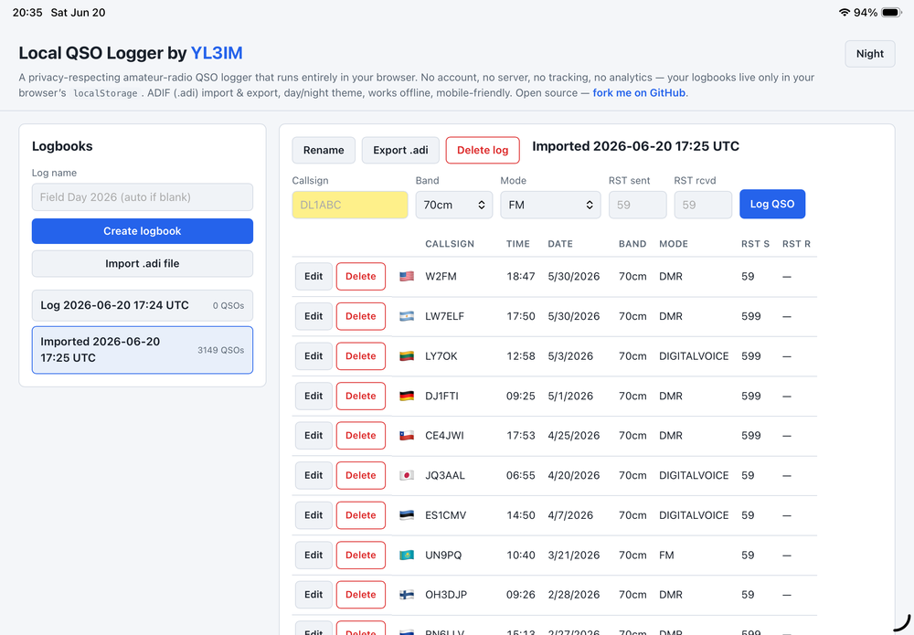
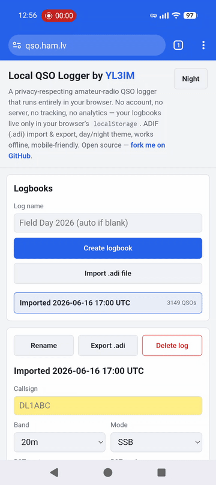

# Local QSO Logger

## Leggi nella tua lingua

🇺🇸 [English](README.md) · 🇨🇿 [Čeština](README.cs.md) · 🇩🇰 [Dansk](README.da.md) · 🇩🇪 [Deutsch](README.de.md) · 🇪🇪 [Eesti](README.et.md) · 🇪🇸 [Español](README.es.md) · 🇫🇷 [Français](README.fr.md) · 🇮🇪 [Gaeilge](README.ga.md) · 🇭🇷 [Hrvatski](README.hr.md) · 🇮🇹 Italiano · 🇱🇻 [Latviešu](README.lv.md) · 🇱🇹 [Lietuvių](README.lt.md) · 🇭🇺 [Magyar](README.hu.md) · 🇳🇱 [Nederlands](README.nl.md) · 🇳🇴 [Norsk](README.no.md) · 🇵🇱 [Polski](README.pl.md) · 🇵🇹 [Português](README.pt.md) · 🇷🇴 [Română](README.ro.md) · 🇸🇰 [Slovenčina](README.sk.md) · 🇸🇮 [Slovenščina](README.sl.md) · 🇫🇮 [Suomi](README.fi.md) · 🇸🇪 [Svenska](README.sv.md) · 🇧🇾 [Беларуская](README.be.md) · 🇧🇬 [Български](README.bg.md) · 🇷🇺 [Русский](README.ru.md) · 🇷🇸 [Српски](README.sr.md) · 🇺🇦 [Українська](README.uk.md) · 🇬🇷 [Ελληνικά](README.el.md)

Un logger QSO radioamatoriale rispettoso della privacy che funziona interamente nel tuo browser. Niente account, niente server, niente tracciamento, niente analitica — i tuoi diari vivono solo nel `localStorage` del browser e non lasciano mai il tuo dispositivo.

Di [YL3IM](https://www.qrz.com/db/YL3IM). Sito del progetto: [qso.ham.lv](https://qso.ham.lv).

## Indice

- [Leggi nella tua lingua](#leggi-nella-tua-lingua)
- [Caratteristiche](#caratteristiche)
- [Per iniziare](#per-iniziare)
- [Installare come PWA su mobile](#installare-come-pwa-su-mobile)
  - [iOS (solo Safari)](#ios-solo-safari)
  - [Android (Chrome / Edge / Firefox)](#android-chrome--edge--firefox)
- [Diari](#diari)
- [QSO](#qso)
- [Import & export ADIF](#import--export-adif)
- [Privacy e dati](#privacy-e-dati)
- [Lingua dell'interfaccia](#lingua-dellinterfaccia)
- [Temi](#temi)
- [Note tecniche](#note-tecniche)
- [Crediti](#crediti)

## Caratteristiche

- Più diari, ciascuno con la propria lista di QSO.
- Azioni sui diari: creare, rinominare, eliminare, importare da ADIF, esportare in ADIF (`.adi`).
- Campi QSO: nominativo, data UTC, ora UTC, banda, modo, RST inviato, RST ricevuto.
- Modificare ed eliminare qualsiasi QSO (con conferma all'eliminazione).
- Valori di default sensati: data/ora UTC di oggi precompilate, default RST in base al modo (59 per modi voce, 599 per CW/digitali), banda e modo persistenti tra QSO consecutivi.
- Indicatore in tempo reale di duplicato del nominativo (informativo — i duplicati sono permessi).
- Colonna bandiera del paese derivata dal prefisso del nominativo (copre ≥99 % dei prefissi radioamatoriali comuni, inclusi nominativi portatili come `9A/M0NCG`).
- Visualizzazione data sensibile al locale nella tabella QSO; archiviazione ISO e output ADIF restano invariati.
- Temi giorno/notte (giorno predefinito; il toggle è nell'intestazione).
- Layout responsivo mobile-friendly con bottoni dimensionati per il touch.
- Funziona completamente offline — nessuna richiesta di rete in alcun momento.
- Installabile come PWA (Aggiungi alla schermata Home / Installa app) quando ospitato su HTTPS.
- Interfaccia disponibile in **28 lingue** (inglese più 22 in alfabeto latino, 5 cirilliche e greco); selettore con emoji bandiera nell'intestazione.

## Per iniziare

Apri semplicemente `index.html` in un browser moderno. Niente build, niente installazione, niente server.

Se vuoi ospitarlo, deposita i file statici (`index.html`, `style.css`, `app.js`, `favicon.svg`, `manifest.webmanifest`, `service-worker.js` e la directory `i18n/` con i 28 file di traduzione) su qualsiasi host statico (GitHub Pages, Netlify, il tuo server web). Funzionerà anche via `file://` — la registrazione del service worker viene automaticamente saltata sul protocollo `file:`, quindi aprire `index.html` direttamente dal disco funziona pulitamente.

Quando servito via HTTPS, l'app diventa installabile come PWA (tramite il menu *Installa app* / *Aggiungi alla schermata Home* del browser) e funziona offline dopo la prima visita grazie a un service worker cache-first che precarica ogni file statico (UI + tutte le traduzioni).

Un diario predefinito viene creato automaticamente alla prima visita, così puoi iniziare a registrare immediatamente.

## Installare come PWA su mobile

Quando l'app è servita via HTTPS (es. GitHub Pages), puoi installarla sulla schermata Home del telefono per farla funzionare a tutto schermo senza la cornice del browser. Dopo il primo avvio, il service worker memorizza tutto in cache, quindi gli avvii successivi funzionano completamente offline.

### iOS (solo Safari)

Su iOS, solo Safari può installare PWA — i browser di terze parti non possono.

1. Apri il sito in **Safari**.
2. Tocca il pulsante **Condividi**.
3. Scegli **Aggiungi alla schermata Home**, poi **Aggiungi**.

Guida:

Sorgente a qualità superiore: [media/iOS_add_to_home_screen.mp4](media/iOS_add_to_home_screen.mp4).

### Android (Chrome / Edge / Firefox)

1. Apri il sito nel tuo browser. Potrebbe apparire automaticamente un prompt *Installa app*.
2. Altrimenti, apri il **menu ⋮** → **Installa app** (o **Aggiungi alla schermata Home** nelle versioni precedenti).

Guida:

Sorgente a qualità superiore: [media/Android_add_to_home_screen.mp4](media/Android_add_to_home_screen.mp4).

## Diari

- **Creare:** scrivi un nome in *Nome del diario* e invia. Se lasci il nome vuoto, sarà di default `Log YYYY-MM-DD HH:MM UTC`.
- **Cambiare:** clicca su qualsiasi diario nella barra laterale.
- **Rinominare:** clicca *Rinomina* nell'intestazione del diario. Premi Invio per salvare, Esc per annullare.
- **Eliminare:** clicca *Elimina diario*. Ti verrà chiesto di confermare. Se elimini l'ultimo diario, ne viene creato uno nuovo automaticamente.

## QSO

- Compila il modulo e premi **Registra QSO**.
- Il nominativo viene automaticamente messo in maiuscolo mentre scrivi.
- Data e ora vengono precompilate ad *adesso* in UTC e si reimpostano dopo ogni QSO registrato; puoi ancora inserire qualsiasi valore.
- Banda e modo persistono tra QSO della stessa sessione, così non devi riselezionarli per ogni contatto.
- RST inviato / RST ricevuto, se lasciati vuoti, ricadono su **59** per modi voce (SSB/FM/AM/DIGITALVOICE) e su **599** per CW e modi digitali (CW/FT8/FT4/RTTY/PSK31/JT65).
- Una chip *Duplicato in questo diario* appare sotto il campo nominativo se il nominativo è già presente nel diario attuale. I duplicati *non* sono bloccati.
- **Modifica un QSO** con il pulsante *Modifica* sulla riga. Il modulo passa alla modalità *Aggiorna QSO*, la riga viene evidenziata e appare un pulsante *Annulla*. Cambiare diario o eliminare il log annulla la modifica automaticamente.
- **Elimina un QSO** con il pulsante *Elimina* sulla riga (chiede conferma).

## Import & export ADIF

- **Esporta**: clicca *Esporta .adi* nell'intestazione del diario. Viene scaricato un file con `ADIF_VER 3.1.4` e `PROGRAMID local-qso` nell'header. Ogni record mappa `CALL`, `QSO_DATE`, `TIME_ON`, `BAND`, `MODE`, `RST_SENT`, `RST_RCVD`.
- **Importa**: clicca *Importa file .adi* sotto il modulo di creazione diario e scegli un file `.adi`/`.adif`. Viene creato un nuovo diario con nome `Importato YYYY-MM-DD HH:MM UTC`. L'importazione non viene mai fusa in un diario esistente.
- Il conteggio della lunghezza del campo è trattato come numero di caratteri, il che funziona per ADIF ASCII (tutti i campi QSO standard). Contenuti multi-byte in campi di testo non essenziali potrebbero essere analizzati in modo strano.

## Privacy e dati

- Tutti i dati sono memorizzati nel `localStorage` del browser sotto la chiave `local-qso:v1`.
- Niente viene trasmesso da nessuna parte. Niente backend, niente chiamate API, niente telemetria, niente analitica.
- Cancellare i dati del sito, usare la modalità privata/incognito o usare un browser/dispositivo diverso significa un diario vuoto — usa *Esporta .adi* per backup.

## Lingua dell'interfaccia

Un selettore di lingua nell'intestazione copre **28 lingue**. Scegline una e il resto dell'interfaccia viene re-renderizzato immediatamente; la tua scelta viene salvata insieme ai tuoi log e rispettata alla prossima visita. L'inglese è il predefinito.

Lingue disponibili (emoji bandiera + nome nativo; ordinate alfabeticamente all'interno di ogni scrittura):

🇺🇸 English · 🇨🇿 Čeština · 🇩🇰 Dansk · 🇩🇪 Deutsch · 🇪🇪 Eesti · 🇪🇸 Español · 🇫🇷 Français · 🇮🇪 Gaeilge · 🇭🇷 Hrvatski · 🇮🇹 Italiano · 🇱🇻 Latviešu · 🇱🇹 Lietuvių · 🇭🇺 Magyar · 🇳🇱 Nederlands · 🇳🇴 Norsk · 🇵🇱 Polski · 🇵🇹 Português · 🇷🇴 Română · 🇸🇰 Slovenčina · 🇸🇮 Slovenščina · 🇫🇮 Suomi · 🇸🇪 Svenska · 🇧🇾 Беларуская · 🇧🇬 Български · 🇷🇺 Русский · 🇷🇸 Српски · 🇺🇦 Українська · 🇬🇷 Ελληνικά

Le etichette tecniche universali rimangono nella loro forma canonica in tutte le lingue: nomi delle bande (`20m`, `70cm`, …), codici dei modi ADIF (`SSB`, `FT8`, `CW`, …), `QSO`, `RST`, `UTC` e codici ISO dei paesi.

Manca una stringa nella tua lingua? Ogni lingua è un piccolo file in [`i18n/`](i18n/) — copia `i18n/en.js`, traduci i valori, salva come `i18n/<codice>.js`, poi aggiungi un tag `<script>` più un'opzione `<select>` in `index.html` e il codice in `SUPPORTED_LANGS` in `app.js`.

## Temi

Il toggle del tema nell'intestazione commuta tra giorno (predefinito) e notte. La preferenza viene salvata insieme ai tuoi log e rispettata alla prossima visita. I selettori nativi data/ora seguono il tema tramite `color-scheme`.

## Note tecniche

- App single-page, HTML + CSS + JavaScript puri. Niente framework, niente build, niente dipendenze.
- File sorgente:
  - `index.html` — markup e meta tag.
  - `style.css` — temi e layout (variabili giorno/notte, media query mobile).
  - `app.js` — stato, persistenza, rendering, parser/serializer ADIF, lookup prefisso nominativo → paese.
  - `favicon.svg` — favicon SVG inline.
  - `manifest.webmanifest` — Web App Manifest (nome, colore tema, scope, icona) per rendere l'app installabile come PWA su mobile e desktop.
  - `service-worker.js` — service worker cache-first che all'installazione precarica ogni file statico, all'attivazione purga le cache vecchie e mantiene l'app pienamente offline dopo la prima visita. La registrazione viene saltata automaticamente per il protocollo `file://`, quindi aprire `index.html` direttamente dal disco resta pulito.
  - `i18n/<lang>.js` — un file di traduzione per ogni lingua supportata (28 totali). Ognuno è una piccola IIFE che assegna a `window.I18N[<lang>]` una mappa piatta chiave→stringa. `t()` e `applyLanguage()` in `app.js` gestiscono il lookup (con fallback all'inglese) e attraversano il DOM aggiornando ogni elemento `[data-i18n*]`.
- Testato su Chromium, Firefox e Safari recenti (desktop + iOS).

## Crediti

Costruito da [YL3IM](https://www.qrz.com/db/YL3IM).

Le bandiere dei paesi si basano su sequenze indicatore regionale Unicode. Si renderizzano correttamente su macOS, iOS, Linux (con un font emoji compatibile con le bandiere) e Android. Windows non include un font bandiere di sistema, quindi le emoji bandiera potrebbero apparire come coppie di lettere lì.
